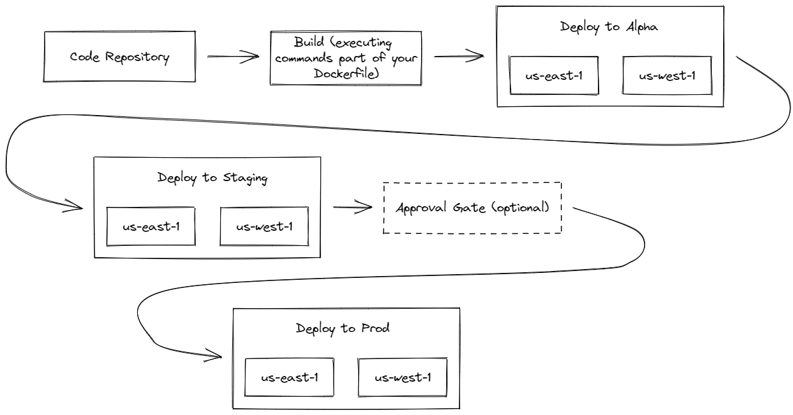

# AWS Streamlined CI/CD - ASCC

ASCC aims at simplifying the creation of a proper CI/CD pipeline for SST applications, using AWS CodePipeline.

Pipelines created with this utility are able to deploy to any number of specified regions, and have three stages: alpha, staging, prod.

Here's what the pipeline looks like:



## Supported Languages

Currently, this pipeline only supports NodeJS SST applications. It should be possible to build a pipeline for any kind of SST
applications with docker. Feel free to open pull requests to add other Dockerfiles for other languages.

## Supported Repository Providers

The only supported repository provider for now is GitHub.

It should be relatively easy to add support for CodeCommit or BitBucket, since they are both
supported by AWS CodePipeline.

## Using ASCC

### 1. Install ASCC

```
npm install -g ascc
```

or

```
npm install --save-dev ascc
```

### 2. Build Dockerfile

Copy one of the example [Dockerfiles](./dockerfile-examples/) at the root of your directory, and tune it to your needs.

### 3. Parameters

Create a parameters file for your pipeline (refer to the Parameters section below)

ASCC expects a JSON file with a predetermined set of parameters. Take a peak at [the example](./docs/cicd_parameters.example.json), or
at the full schema [the JSON schema](./src/jsonParametersSchema.ts) for all the details.

### 4. Create Your CICD Pipeline

```
ascc create --params-file path/to/your/params/file [--aws-profile your_profile]
```

ASCC will use your default AWS profile, or any other profile that you can specify with the `--aws-profile` option.

### 5. Remove Your CICD Pipeline

```
ascc remove --params-file path/to/your/params/file [--aws-profile your_profile]
```

## Road Map

- [ ] Add support for end-to-end tests based on user-defined AWS Lambda Functions
